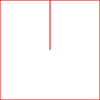

# Samples

### [Sample1.logo](./sample1.logo)

Starts in the origin, goes up 50 units, and draws a square with 100 of width. This code only works if you have proper handling of negative values (or if you change the turtle starting position).

### [Sample2.logo](./sample2.logo)

Similar to the previous one, but starts by raising the pen for the first movement, thus drawing a perfect square.

### [Sample3.logo](./sample3.logo)

The same square, same position, but now using a repetition statement. The first point is
computed through the __setxy__ command, with the pen up.

### [Sample4.logo](./sample4.logo)

A star, by repeating five times a line, with the correct angle.

### [Sample5.logo](./sample5.logo)

Still using repeat, but incrementing a variable, showing how to set colours, in this case,
grays from black to white. Note that the online interpreter at https://www.calormen.com/jslogo/
does not support variables as parameters to the __setpencolor__ command.

### [Sample6.logo](./sample6.logo)

Changing the width of the pen. Also, adding to repeat the __ifelse__ statement.

